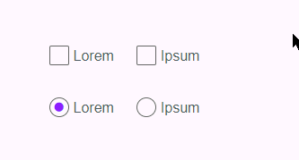

# Custom Checkbox Radio

CSS based custom checkboxes and radios; a CSS module solution.



## Install

    npm i custom-checkbox-radio

## Include

Depending on your current directory and frontend stack, you'll want something along the lines of one of:

```scss
@import "custom-checkbox-radio";
```

## Add

Note, your labels must proceed the inputs and all have suitable name/id/for attributes.

````scss
@use 'custom-checkbox-radio-scss/variables' with (
  $background: #f00 // Override any variables
);
@use 'custom-checkbox-radio-scss' as ccr;
@use 'custom-checkbox-radio-scss' as ccr;
.checkbox {
  @include ccr.checkbox;
}
.radio {
  @include ccr.radio;
}
```

```jsx

import formControlStyles from "../formControl.module.scss";

() => (
    <>
        <fieldset>
            <legend>Checkboxes</legend>
            <p className="{formControlStyles.checkbox}">
                <input type="checkbox" name="lorem-1" id="lorem-1" />
                <label htmlFor="lorem-1">Lorem</label>
            </p>
            <p className="{formControlStyles.checkbox}">
                <input type="checkbox" name="lorem-2" id="lorem-2" checked />
                <label htmlFor="lorem-2">Ipsum</label>
            </p>
        </fieldset>

        <fieldset>
            <legend>Radios</legend>
            <p className="{formControlStyles.radio}">
                <input type="radio" name="ipsum" id="ipsum-1" />
                <label htmlFor="ipsum-1">Lorem</label>
            </p>
            <p className="{formControlStyles.radio}">
                <input type="radio" name="ipsum" id="ipsum-2" checked />
                <label htmlFor="ipsum-2">Ipsum</label>
            </p>
        </fieldset>
    </>
);
````

## Customise

Written in a non-invasive kinda way, so you can add your own styles to, say, `input[type="radio"] + label::after`, or simply override the various variables set in [the SCSS file](https://github.com/entozoon/custom-checkbox-radio-scss/blob/master/_variables_.scss).

## Browser Support

IE9 +
